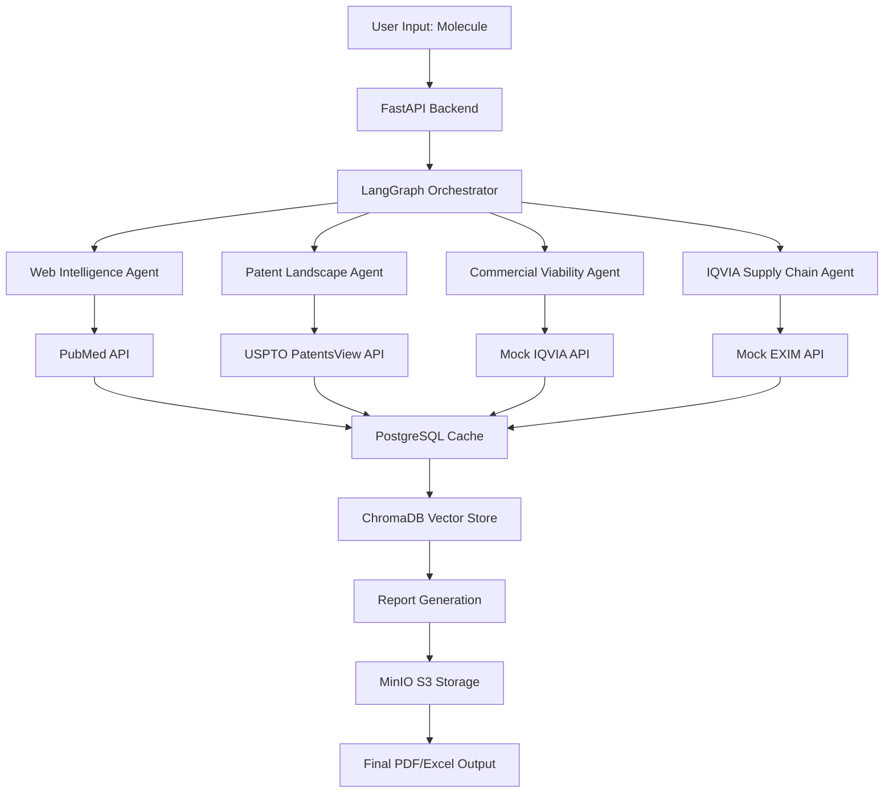

# AgentRX — Project Context

## 1. Project Overview & Problem Statement

**Project Name:** AgentRX  
**Category:** MedTech / Agentic-AI  
**Problem Being Solved:** Automating pharmaceutical drug repurposing discovery. Manual process currently takes 2–3 months; AgentRX targets reduction to minutes via autonomous multi-agent orchestration.  
**Anti-Goal:** We are NOT building a PDF chatbot. The core value is agentic pipeline orchestration over structured + unstructured pharma data.

AgentRX is a **Decision Intelligence Platform** built on a **stateful, asynchronous Multi-Agent Orchestration System**. A user inputs a target molecule → a Master Agent decomposes the goal → dispatches parallel Worker Agents → output is a structured PDF/Excel product story, NOT a chat response.

## 2. Architecture Overview (Diagram in Mermaid)

## 3. Tech Stack Reference

| Layer | Stack | Role |
|---|---|---|
| Frontend & Synthesis | Next.js, Tailwind CSS | "Mission Control" dashboard with live agent telemetry |
| Core Intelligence | LangGraph, LangChain | State management, RAG routing, agent retry logic |
| Neural Backend (API) | FastAPI, Celery, Redis | Async task queue; concurrent external API calls |
| Data Fabric | PostgreSQL, Neo4j, ChromaDB/FAISS, AWS S3 | Relational + graph + vector + cold storage |

From codebase:  
- FastAPI for API  
- LangGraph for orchestration  
- Celery for async tasks  
- PostgreSQL, Redis, ChromaDB as per docker-compose.yml  
- Requirements.txt includes langchain, httpx, etc.

## 4. Agent Registry (all agents, their inputs, outputs, data sources, state mutations)

| Agent | Data Source | Responsibility | Input Schema | Output Schema | State Mutations |
|---|---|---|---|---|---|
| Web Intelligence Agent | PubMed Entrez API | Find unlinked diseases sharing pathways | `{"molecule": str}` | `{"diseases_bio": List[Dict]}` | Updates `diseases_bio` |
| Patent Landscape Agent | USPTO PatentsView API | Check for active patents | `{"merged_diseases": List, "molecule": str}` | `{"ip_cleared_diseases": List}` | Updates `ip_cleared_diseases` |
| Commercial Viability Agent | Mock IQVIA API | Evaluate TAM, CAGR | `{"ip_cleared_diseases": List}` | `{"commercial_data": List}` | Updates `commercial_data` |
| IQVIA Supply Chain Agent | Mock IQVIA/EXIM APIs | Supply chain analysis | State dict | `{"supply_chain_data": Dict}` | Updates `supply_chain_data` |

All agents inherit from BaseAgent with retry logic (max 2 retries).

## 5. M2M Pipeline (Mechanism-to-Market) — Step-by-Step

The pipeline runs in strict sequential phases:

1. **Pharmacodynamic Mapping:** Web Intelligence Agent → PubMed → Extract diseases with pathway overlap.
2. **Merge Data:** Combine results into `merged_diseases`.
3. **IP Whitespace Clearance:** Patent Landscape Agent → USPTO → Filter out patented indications.
4. **Commercial Viability Screening:** Commercial Viability Agent → IQVIA → Filter by TAM threshold.
5. **IQVIA EXIM Analysis:** IQVIA Supply Chain Agent → Mock APIs → Add supply chain data.

Interrupts before commercial viability for human approval.

## 6. Background Job & Cron Schedule Registry

> ⚠️ NOT YET IMPLEMENTED — see engineering decision in Section 16.

Proposed: PubMed cache job every 6 hours, Patent cache every 24 hours.

## 7. Database Schema Reference

### 7.1 PostgreSQL Tables

> ⚠️ NOT YET IMPLEMENTED — see engineering decision in Section 16.

Proposed: `pubmed_cache`, `patent_cache`, `trend_snapshots`, `exim_data`, `analyst_notes`.

### 7.2 Neo4j Graph Schema

Nodes: Molecule, Indication, Patent, ClinicalTrial, MarketSegment, Competitor.  
Edges: TARGETS, HAS_PATENT, USED_IN, BELONGS_TO, COMPETES_WITH, SHARES_PATHWAY.

### 7.3 ChromaDB / FAISS Collections

> ⚠️ NOT YET IMPLEMENTED — see engineering decision in Section 16.

Collections for vector embeddings of literature.

### 7.4 Redis Keys & TTLs

Used for Celery broker/backend, no custom keys defined yet.

## 8. API Endpoint Reference (all routes, methods, request/response shapes)

- `POST /api/pipeline/start`  
  Request: `{"molecule": str}`  
  Response: `{"status": str, "thread_id": str, "pending_candidates": List}` or error.

- `POST /api/pipeline/resume`  
  Request: `{"thread_id": str}`  
  Response: `{"status": str, "final_candidates": List, "iqvia_exim_analysis": Dict}`.

- `GET /health`  
  Response: `{"status": str, "environment": str, "orchestrator": str, "message": str}`.

## 9. RAG & Chunking Strategy

> ⚠️ NOT YET IMPLEMENTED — see engineering decision in Section 16.

Semantic chunking, 512 tokens, overlap 64.

## 10. Memory Management (STM vs LTM)

STM: LangGraph state graph scratchpad.  
LTM: ChromaDB for RAG.

## 11. Depth Control System

> ⚠️ NOT YET IMPLEMENTED — see engineering decision in Section 16.

Shallow/Standard/Deep modes.

## 12. Feature Specifications

### 12.1 Instant Search (DB-backed Cache)

> ⚠️ NOT YET IMPLEMENTED — see engineering decision in Section 16.

Cron: 6h for PubMed, 24h for patents. Cache tables with upsert.

### 12.2 Manual Search Mode

> ⚠️ NOT YET IMPLEMENTED — see engineering decision in Section 16.

Bypasses cache, hits live APIs.

### 12.3 Trend Analysis Module

> ⚠️ NOT YET IMPLEMENTED — see engineering decision in Section 16.

`trend_snapshots` table, weekly cron.

### 12.4 Costing Engine (EXIM)

> ⚠️ NOT YET IMPLEMENTED — see engineering decision in Section 16.

`exim_data` table, API sourcing risk.

### 12.5 Competitive Analysis Engine

> ⚠️ NOT YET IMPLEMENTED — see engineering decision in Section 16.

Neo4j edges for comparisons.

### 12.6 Data Notepad

> ⚠️ NOT YET IMPLEMENTED — see engineering decision in Section 16.

`analyst_notes` table.

## 13. Competitive Analysis Knowledge Graph Schema

As in Section 7.2.

## 14. Dashboard UI Contract (what the frontend expects from each API)

> ⚠️ NOT YET IMPLEMENTED — see engineering decision in Section 16.

Real-time telemetry, DAG view, trend charts.

## 15. Environment Variables Reference (.env keys and their purpose)

From .env.example: ENVIRONMENT, LOG_LEVEL, VALID_API_TOKENS, POSTGRES_URL, REDIS_URL, CHROMADB_HOST/PORT, NEO4J_URI/USER/PASSWORD, PUBMED_API_KEY, USPTO_API_KEY, LLM_PROVIDER/MODEL_NAME, GOOGLE_API_KEY, S3_ENDPOINT_URL/BUCKET, AWS_ACCESS_KEY_ID/SECRET.

## 16. Open Engineering Decisions & TODOs

- Implement background jobs for caching.
- Add database models and schemas.
- Build frontend with Next.js.
- Integrate Neo4j and vector stores.
- Add depth control and RAG chunking.
- Implement all features in Section 12.

## 17. Glossary (pharma + tech terms used in this codebase)

- M2M: Mechanism-to-Market pipeline.
- TAM: Total Addressable Market.
- CAGR: Compound Annual Growth Rate.
- FTO: Freedom to Operate (IP clearance).
- SMILES: Simplified Molecular Input Line Entry System.
- LangGraph: State machine for agent orchestration.
- ChromaDB: Vector database for embeddings.